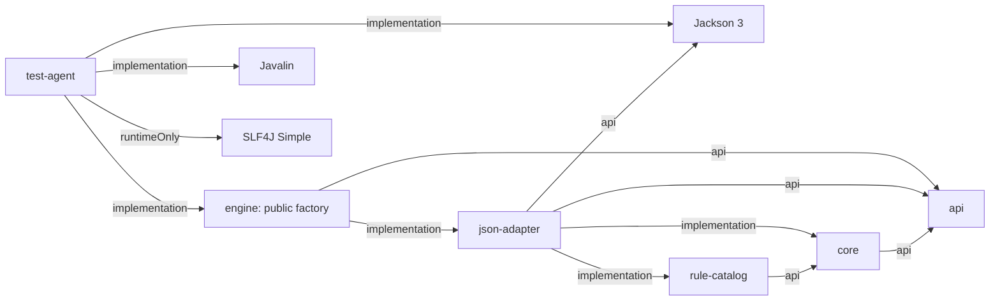
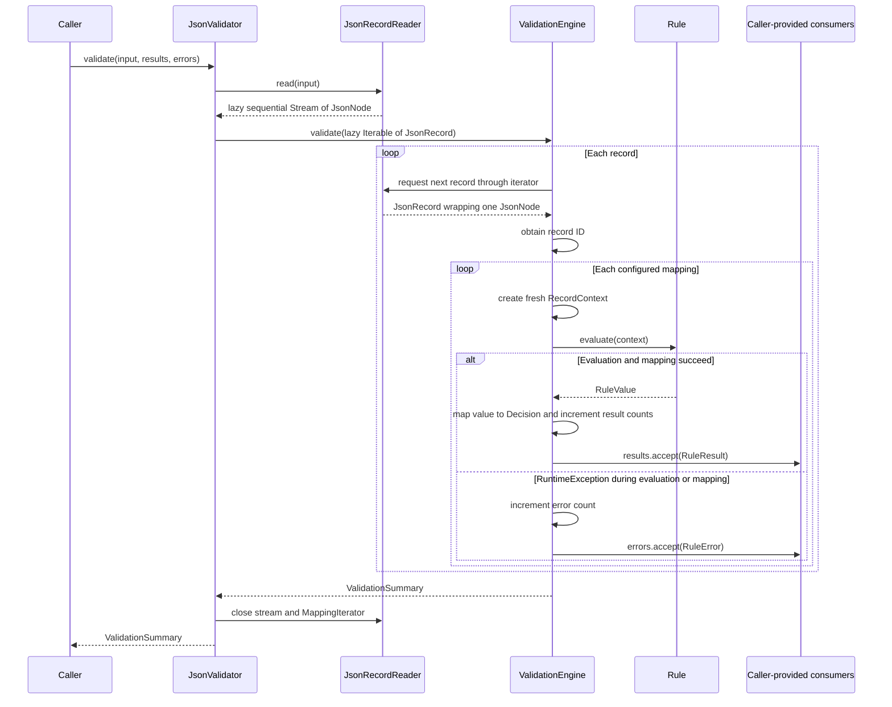
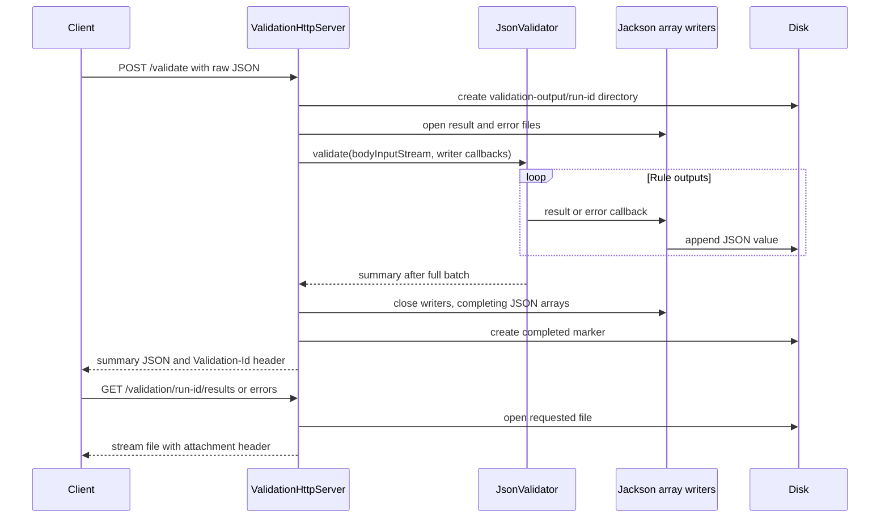

# Validation Engine

## Priorities and scope

Within the recruitment time-box, I focused on a reusable library with a framework-free core. The core provides declarative decision mappings, explainable results, isolated rule failures, and streaming input and output. It can be used by an HTTP service, batch worker, or scheduled job.

This is an intentional time-box trade-off. I prioritized the public library boundary and the supplied fixture. Rule selection, configurable batching, parallel execution, and production operations remain future work. Callers receive result and error callbacks and can write to files, bounded batches, or queues.

The input contract assumes valid JSON syntax. Rules handle invalid record data, such as missing fields. Invalid JSON syntax stops parsing because the reader cannot safely find the next record. A host can later split valid input at record boundaries and process chunks with bounded parallelism. Asynchronous delivery, retries, and back-pressure are outside this POC.

## Module dependencies

An arrow points from a module to one of its dependencies. Labels show the Gradle dependency scope. Test dependencies are omitted.



| Module | Responsibility | Java package |
| --- | --- | --- |
| api | Validator contract, results, errors, summary, outcome enums | `com.cdq.validationengine.api` |
| engine | Public factory and library assembly, published as validation-engine | `com.cdq.validationengine.engine` |
| core | Rule execution, decision mapping, field tracking | `com.cdq.validationengine.core` and `.model` |
| rule-catalog | Java rules, registry, packaged mapping JSON | `com.cdq.validationengine.rulecatalog` and `.rule` |
| json-adapter | Jackson reader, record adapter, catalog reader, validator implementation | `com.cdq.validationengine.jsonadapter` |
| test-agent | Javalin HTTP application and file output | `com.cdq.validationengine.testagent` |

The `engine` module is the public facade. `test-agent` is the runnable example host. `api` and `core` have no external production dependencies.

## Public entry point and initialization

[Validator](api/src/main/java/com/cdq/validationengine/api/Validator.java) declares:

```java
ValidationSummary validate(
        InputStream input,
        Consumer<RuleResult> results,
        Consumer<RuleError> errors);
```

[Validators](engine/src/main/java/com/cdq/validationengine/engine/Validators.java) is the public factory. `createDefault()` returns `Validator` and creates [JsonValidator](json-adapter/src/main/java/com/cdq/validationengine/jsonadapter/JsonValidator.java). It:

1. Loads the complete mapping list using `JsonRuleCatalogReader.defaults()`.
2. Gets the Java rule registry from `RuleCatalog.defaults()`.
3. Creates a `JsonRecordReader` and `ValidationEngine`.

The mapping resource is [rule-catalog.json](rule-catalog/src/main/resources/rule-catalog.json). It is loaded from the rule-catalog module. Unknown JSON properties are rejected. A missing resource raises `IOException`.

The custom `JsonValidator` constructor is package-private. Consumers use the predefined catalog through the factory. A public custom-rule API is future work. The engine matches mappings to rules by ID. Duplicate mappings can fail construction. A missing implementation can fail when that rule is evaluated.

## Streaming validation workflow



[JsonRecordReader](json-adapter/src/main/java/com/cdq/validationengine/jsonadapter/JsonRecordReader.java) uses Jackson `readValues(input)` and returns a sequential stream over its `MappingIterator`. The input is expected to be a JSON array. No schema validation is performed.
Each record is materialized as one `JsonNode`; the whole batch is not collected. Memory depends on the current record, catalog, parser buffers, and caller behavior. Callers must use bounded output buffering.
Callbacks execute synchronously on the validation thread. Callers can provide file writers, database calls, or Kafka producers. Kafka delivery, retries, flushing, and asynchronous failure handling are outside the library.
`JsonValidator` closes the stream and Jackson iterator in try-with-resources. Callers should not assume the supplied input remains open. Output consumers and their resources are managed by the caller.

## Rules and declarative decisions

[ValidationEngine](core/src/main/java/com/cdq/validationengine/core/ValidationEngine.java) evaluates every configured mapping for every record. It does not filter by status, category, country scope, or required fields. Records are read sequentially. Mapping order is not part of the API.

Java rules compute `RuleValue`. The engine derives the decision with:

```java
mapping.decisions().getOrDefault(ruleValue, mapping.defaultDecision())
```

The current catalog contains:

| Rule | Java computation | Configured decisions | Default |
| --- | --- | --- | --- |
| countryBlocked | Country equals ZZ → BLOCKED; otherwise OK, including missing country | BLOCKED → INVALID | NOT_APPLICABLE |
| vatFormat | Non-null VAT string with length ≥ 9 → OK; otherwise BAD | OK → VALID; BAD → INVALID | REVIEW |
| ibanFormat | Non-empty IBAN starting with a non-null country → OK; otherwise BAD | OK → VALID; BAD → INVALID | REVIEW |

These are simple checks, not complete VAT or IBAN validators. All mappings currently have severity ERROR, status RELEASED, countryScope WORLD, and category FORMAT. These metadata fields are stored but do not control execution.

## Record identity and provenance

[Record](core/src/main/java/com/cdq/validationengine/core/model/Record.java) obtains its ID from the `id` field using `toString()`, or `"<missing id>"` if absent/null.

A new [RecordContext](core/src/main/java/com/cdq/validationengine/core/model/RecordContext.java) is created for each record and rule. It caches fields in a `LinkedHashMap`. Only fields read by the rule appear in provenance. For example, an empty IBAN returns BAD before the country is read.

Missing and JSON-null values become Java `null`. String fields return text. A numeric or boolean value passed to `stringField` causes `IllegalArgumentException`. Missing fields do not automatically create errors; each rule decides how to handle them.

Current limitation: object and array fields are not supported by the scalar rule accessors. Nested-field access is future work.

## Results, errors, and summary

| Type | Contents |
| --- | --- |
| RuleResult | recordId, ruleId, severity, computedValue, decision, fieldsRead |
| RuleError | recordId, ruleId, errorType, message, fieldsRead |
| ValidationSummary | resultCount, errorCount, decisions map, severities map |

A successful evaluation can produce INVALID: this is still a result. An ERROR severity result also does not increment `errorCount`. The latter counts caught execution failures.

The engine catches `RuntimeException` during rule evaluation, decision mapping, and result creation. It records the exception type and message, then continues. It does not store a stack trace or log the full exception.

Failures while reading JSON, obtaining the record ID, or invoking output consumers are outside this recovery boundary and abort the call. Malformed JSON is not converted into a `RuleError` for each rule.

The summary initializes all decision/severity counts to zero. It is mutable and its getters expose mutable maps. Result/error provenance maps are also not defensively copied.

## HTTP workflow and storage

[ValidationApplication](test-agent/src/main/java/com/cdq/validationengine/testagent/ValidationApplication.java) starts a server on localhost:8080 and registers a shutdown hook. [ValidationHttpServer](test-agent/src/main/java/com/cdq/validationengine/testagent/ValidationHttpServer.java) uses one default JsonValidator and writes each run to a unique directory.



| Method | Route | Response |
| --- | --- | --- |
| GET | /health | OK |
| POST | /validate | Summary JSON and Validation-Id response header |
| GET | /validation/{id}/results | rule-results.json |
| GET | /validation/{id}/errors | rule-errors.json |

POST consumes the raw request body, not multipart uploads. It runs synchronously and returns the summary after validation and file closure. Results are stored on the server; the POST response contains the summary, not the result stream.

```text
validation-output/
  <Validation-Id>/
    rule-results.json
    rule-errors.json
    completed
```

The base path is relative to the process working directory. Gradle tests use the project directory. Other launch methods may use a different directory.

Downloads use `InputStream.transferTo` and set JSON content type and `Content-Disposition`. They do not check the completed marker. Missing-run handling, cleanup, retention, authentication, and run-ID validation are not implemented. An aborted run can leave partial files without a completed marker.

## API visibility and publication limits

The public entry point is `com.cdq.validationengine.engine.Validators.createDefault()` in `engine`, published as `validation-engine`. It returns the `Validator` interface and constructs the existing JSON implementation with predefined rules. The HTTP example depends on `engine` and explicitly declares Jackson for its own output serialization. Depending on `api` alone supplies contracts and models but no implementation.

Gradle exposes `api` to consumers of `validation-engine`; the engine's adapter dependency is an implementation dependency. Core, catalog, and the adapter are required at runtime. This is a compile-classpath boundary, not Java access control. Consumers can still access internal public classes if they add those modules directly. The custom `JsonValidator` constructor is package-private, but `JsonRuleCatalogReader` is still public and exposes `RuleMapping`; this can be tightened later.

All five library modules have Maven publications. `engine` is published as `validation-engine`; the supporting artifacts retain their module names. Consumers declare only `validation-engine`, which exposes `api` at compile time and resolves the adapter, core and catalog at runtime. These dependencies are separate JARs, not a bundled fat JAR.

## Trade-offs and next steps

- **Requirement scope:** the supplied F1–F4 scenario is implemented for the predefined catalog. F5 is addressed through record-by-record input and callback-based output, which avoids collecting the batch in memory. F6 rule selection is deferred. Status, category, and country scope are stored but do not filter execution. Configurable batching is also deferred.
- **Library boundary:** `engine` publishes the `validation-engine` artifact. `api` contains the consumer contract. JSON parsing, rule execution, and predefined rules are implementation modules. A custom-adapter API can be added later without changing the default consumer path.
- **F5 scale:** the reader processes one record at a time, but this checkout has no dedicated million-record benchmark. A future test should measure different record sizes and real output sinks. Host-controlled chunking and bounded concurrency can then be added if needed.
- **Robustness:** malformed JSON syntax, record-ID failures, and output callback failures abort the run. Catalog validation, nested-field access, retries, cancellation, and delivery tracking are future work.
- **Operations:** the example host has basic lifecycle and completion logging. Metrics, tracing, authentication, retention, cleanup, and production HTTP error handling are outside this POC.

The chosen trade-off is to establish testable domain behavior and replaceable input and output boundaries first. With more time, I would add a deliberate custom-rule and selection API, configurable batching, a repeatable scale test, and host-level orchestration without coupling those concerns to the rules.

## Source references

- [Gradle module declarations](settings.gradle) and [shared build/publication configuration](build.gradle)
- [ValidationEngine](core/src/main/java/com/cdq/validationengine/core/ValidationEngine.java)
- [Validators](engine/src/main/java/com/cdq/validationengine/engine/Validators.java)
- [JsonValidator](json-adapter/src/main/java/com/cdq/validationengine/jsonadapter/JsonValidator.java)
- [RuleCatalog](rule-catalog/src/main/java/com/cdq/validationengine/rulecatalog/RuleCatalog.java)
- [ValidationHttpServer](test-agent/src/main/java/com/cdq/validationengine/testagent/ValidationHttpServer.java)

This document records the current implementation; the limitations above have not been changed as part of this documentation update.
